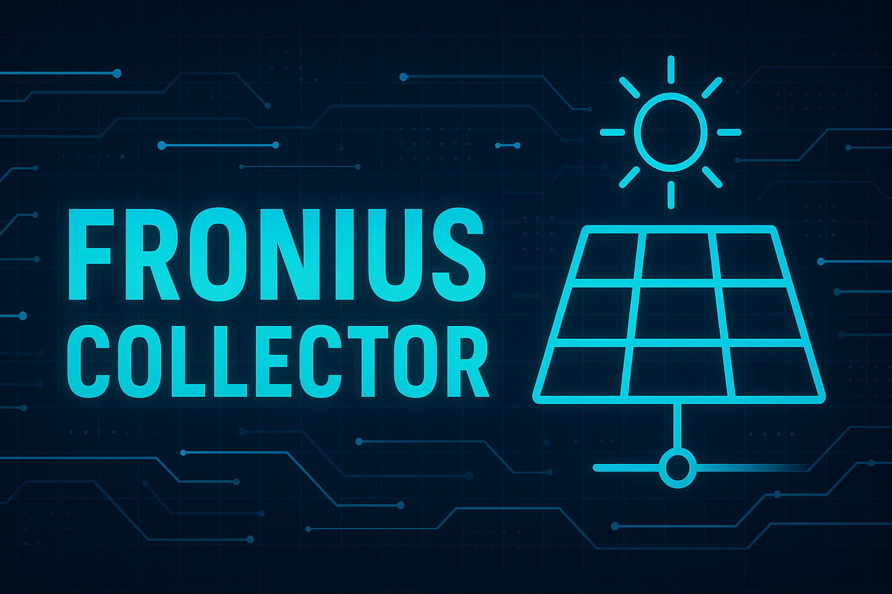

# Fronius GEN24 Data Collector 

A dockerized Python application for real-time data collection from Fronius GEN24 inverters, with local InfluxDB storage and an interactive web dashboard for visualization. 



**This project is aimed at people who don't want to share their solar production and consumption data with external services provided by the hardware vendor. The collected data is stored persistently on your local infrastructure and visualized through an integrated interactive dashboard or Grafana.**

---

## 📌 Overview

This project includes two main components:

1. **Collector Service** - Collects real-time energy data from Fronius GEN24 inverters via HTTP API and sends it to local InfluxDB.
2. **Dashboard Service** - A modern web interface displaying real-time metrics, 24-hour power flow charts, 7-day grid economics analysis, and interactive system status monitoring.

### Key Features

- **Real-Time Data Collection** - Fetches live data from Fronius inverters via HTTP API.
- **InfluxDB Integration** - Sends data to InfluxDB for time-series storage and analysis.
- **Interactive Web Dashboard** - Modern dark-themed UI with real-time charts and system monitoring.
- **Colorized Terminal Output** - Immediate visual feedback with color-coded metrics.
- **Comprehensive Logging** - Detailed logs to file for troubleshooting.
- **Battery & Grid Metrics** - SOC, charging/discharging power, grid import/export tracking.
- **Environment-Based Configuration** - Flexible setup via `.env` file.
- **Auto-Refresh Data** - Dashboard updates automatically (30s metrics, 60s charts, 5m analytics).
- **System Health Monitoring** - Database latency, API status, memory usage, uptime tracking.

---

## 🛠️ System Architecture

The project runs three Docker services:

| Service | Purpose | Port |
|---------|---------|------|
| **collector** | Polls Fronius inverter & writes to InfluxDB | - |
| **dashboard** | FastAPI backend + web UI | 8080 |
| **influxdb2** | Time-series database | 8086 |

---

## 📦 Prerequisites

- **Docker Engine and Docker Compose**
- **Fronius Inverter** (GEN24 or compatible model)
- **InfluxDB 2.x** (included in docker-compose, or use existing instance)
  - An existing bucket (e.g., "fronius_clean")
  - An existing Access Token with write privileges
- **Network Access**:
  - Between collector and Fronius inverter (port 80/443)
  - Between collector and InfluxDB server (port 8086)
  - To dashboard web UI (port 8080)

## 🛠️ Installing Requirements for Docker Compose (Linux)

To use Docker Compose, ensure **Docker Engine** and **Docker Compose** are installed on your system. Below are installation instructions for popular Linux distributions:

---

### ✅ Debian/Ubuntu

```bash
# Update package index
sudo apt update

# Install dependencies
sudo apt install -y apt-transport-https ca-certificates curl software-properties-common

# Add Docker's official GPG key
curl -fsSL https://download.docker.com/linux/ubuntu/gpg | sudo gpg --dearmor -o /usr/share/keyrings/docker.gpg

# Add Docker repository
echo "deb [arch=$(dpkg --print-architecture) signed-by=/usr/share/keyrings/docker.gpg] https://download.docker.com/linux/ubuntu $(lsb_release -cs) stable" | sudo tee /etc/apt/sources.list.d/docker.list > /dev/null

# Update package index again
sudo apt update

# Install Docker Engine and Docker Compose
sudo apt install -y docker-ce docker-ce-cli docker-compose
```

---

### ✅ Arch Linux

```bash
# Install Docker and Docker Compose using pacman
sudo pacman -S docker docker-compose
```

---

### ✅ Fedora

```bash
# Enable the COPR repository for Docker
sudo dnf copr enable docker/docker

# Install Docker Engine and Docker Compose
sudo dnf install -y docker docker-compose
```

---

### ✅ General Post-Installation Steps

After installation:

1. **Start and enable Docker service**:
   ```bash
   sudo systemctl start docker
   sudo systemctl enable docker
   ```

2. **Add your user to the `docker` group** (to avoid using `sudo`):
   ```bash
   sudo usermod -aG docker $USER
   ```
   > Log out and back in, or run `newgrp docker` to apply group changes.

3. **Verify installation**:
   ```bash
   docker --version
   docker-compose --version
   ```

---

### 📌 Notes

- Ensure your system is up to date before installing.
- If using a different Linux distribution, refer to the [official Docker documentation](https://docs.docker.com/engine/install/).`

### 🔧 Configuration Details

The container is configured for runtime with the following environment variables best declared in a separate .env file.
See example below.

## 📊 Data Structure

The script collects the following metrics, stored with units and data types:

| Field Name                  | Description                                 | Unit | Data Type |
|-----------------------------|---------------------------------------------|------|-----|
| `Battery_SOC`               | Battery state of charge                     | %    | float     |
| `Solar_Produced_Current`    | Current solar production                    | kW   | float     |
| `Consumption_Current`       | Current energy consumption                  | kW   | float     |
| `Grid_Consumption_Current`  | Current grid import                         | kW   | float     |
| `Grid_FeedIn_Current`       | Current grid export                         | kW   | float     |
| `Grid_FeedIn_Total`         | Total energy exported to grid               | kWh  | float     |
| `Grid_Consumption_Total`    | Total energy consumed from grid             | kWh  | float     |
| `Consumption_Total`         | Total energy consumed by site               | kWh  | float     |
| `Solar_Produced_Total`      | Total energy produced by solar              | kWh  | float     |
| `Autonomy_Percentage`       | Percentage of energy self-sufficiency       | %    | float     |
| `Logged_At`                 | Timestamp of data collection                | s    | int       |

---

## 📁 Logging

- **Log File**: `collector.log` is created in the working directory.
- **Content**: Includes script start/end, HTTP requests, data collection, and errors.
- **Example Log Entry**:

```
[2025-10-17/08:29:20] Solar=3.37 | Load=1.41 | Grid+0.03/-0.00kW | SOC=10.40% | Batt+1.87/-0.00kW | Auto=100.00% | ConsTot=2115.04kWh | GridConsTot=535.56kWh | GridFeedTot=2115.04kWh
[2025-10-17/08:29:30] Solar=3.37 | Load=1.42 | Grid+0.01/-0.00kW | SOC=10.40% | Batt+1.90/-0.00kW | Auto=100.00% | ConsTot=2115.04kWh | GridConsTot=535.56kWh | GridFeedTot=2115.04kWh
[2025-10-17/08:29:40] Solar=3.37 | Load=1.43 | Grid+0.00/-0.00kW | SOC=10.50% | Batt+1.89/-0.00kW | Auto=99.75% | ConsTot=2115.04kWh | GridConsTot=535.56kWh | GridFeedTot=2115.04kWh
[2025-10-17/08:29:50] Solar=3.37 | Load=1.42 | Grid+0.00/-0.00kW | SOC=10.50% | Batt+1.89/-0.00kW | Auto=100.00% | ConsTot=2115.04kWh | GridConsTot=535.56kWh | GridFeedTot=2115.04kWh
```

---

## 🛠️ Building and Using the Docker Image Locally

This section provides step-by-step instructions for **building** and **running** the `fronius-collector` Docker image using the provided `Dockerfile`, `.env` file, and `docker-compose.yaml`. It also includes notes on configuration, improvements, and potential issues.

---

### 📦 Prerequisites

Before proceeding, ensure the following tools are installed:

- **Docker Engine** (https://docs.docker.com/engine/install/)
- **Docker Compose** (https://docs.docker.com/compose/install/)

You can verify the installation with:

```bash
docker --version
docker-compose --version
```

---

### 🧱 Step 1: Build the Docker Image with Docker CLI

```bash
# Pull repository from Github
git clone https://github.com/xknex/fronius-collector.git

# Navigate to the project directory
cd ./fronius-collector

# Build the Docker image
docker build -t fronius-collector .
```
---

### 📁 Step 2: Create and Configure the `.env` File

Create a `.env` file in the project directory and customize the values according to your setup:

```env
# Fronius Inverter Configuration
FRONIUS_INVERTER_HOST=192.168.1.100          # IP or hostname of your Fronius inverter
FRONIUS_INVERTER_USE_HTTPS=false             # Use HTTPS (typically false on local network)
FRONIUS_INVERTER_VERIFY_SSL=false            # Verify SSL certificates
FRONIUS_INVERTER_DEVICE_ID=1                 # Device ID (usually 1)

# InfluxDB Configuration
INFLUX_URL=http://influxdb2:8086             # InfluxDB URL (use 'influxdb2' for docker-compose)
INFLUX_TOKEN=your_influxdb_token_here        # InfluxDB API token
INFLUX_ORG=org                               # InfluxDB organization name
INFLUX_BUCKET=fronius_clean                  # InfluxDB bucket name

# Collection & Tagging
POLLING_INTERVAL=10                          # Seconds between data collection (default: 10)
TAG_SOURCE=SymoGEN24                         # Source tag for data identification
TAG_SITE=home                                # Site tag (useful for multi-site setups)

# Optional: Additional custom tags
TAGS=location=garage,env=prod
```

> **⚠️ Important**: Replace placeholder values with your actual InfluxDB token and Fronius inverter IP/hostname.

To get your InfluxDB token:
1. Log in to your InfluxDB UI (http://localhost:8086)
2. Navigate to **API Tokens** section
3. Generate a new token with write access to your bucket

---

### 🚀 Step 3: Run the Services with Docker Compose

Once the `.env` file is set up, run the services using:

```bash
docker compose up -d
```

This will:

- Start the `fronius-collector` service (using the image built in Step 1)
- Start the `influxdb2` service (optional, can be removed if you have an existing InfluxDB instance)

> 📌 If you're not using InfluxDB, remove the `influxdb2` service from the `docker-compose.yaml` file.

> **If your ./logs directory is not created automatically, there could be a permission problem, which has been observed on Windows environments. You can create it manually inside the `fronius-collector` direcory.**
---

### 📊 Step 4: Access Dashboard & Verify Services

**Dashboard Access:**
- Open your browser and navigate to: **http://localhost:8080**
- You should see the Fronius Energy Dashboard with real-time metrics and charts

**Verify Data Collection:**
- Log in to InfluxDB at **http://localhost:8086** (if using the included service)
- Use the Data Explorer to check written data in your 'fronius_clean' bucket
- Logs are stored in `./logs/collector.log`

Check collector logs:
```bash
docker logs -f fronius-collector
```

Check dashboard logs:
```bash
docker logs -f dashboard
```

---

## 📊 Dashboard Features

The web dashboard provides real-time monitoring and analysis:

### Real-Time Metrics (5 Cards)
- **Solar Production** - Current kW from panels
- **Consumption** - Current home consumption in kW
- **Grid Feed-In** - Current export to grid in kW
- **Battery SOC** - Current battery state of charge (%)
- **Autonomy** - Current self-sufficiency percentage (%)

Each metric shows dynamic status indicators (Active/Idle, Charging/Discharging, etc.)

### Charts & Analytics
1. **Power Flow (24h)** - Line chart of solar production vs consumption over 24 hours
2. **Energy Distribution** - Doughnut chart showing battery, home consumption, and grid export percentages
3. **Grid Economics (7d)** - Bar chart comparing daily import costs (0.30€/kWh) vs export income (0.06€/kWh)
4. **Grid Balance (Today)** - Bar chart of today's import vs export amounts

### System Monitoring
- **Status Indicator** - Click the status indicator in the header to open system details modal
- **Database Latency** - Connection latency to InfluxDB in milliseconds
- **API Status** - Dashboard service health status
- **System Uptime** - How long the dashboard has been running
- **Memory Usage** - Current memory consumption of the dashboard process

### Auto-Refresh Intervals
- Metric cards: **30 seconds**
- 24-hour chart: **60 seconds**  
- 7-day analytics: **5 minutes**
- Today's stats: **2 minutes**
- Health check: **On-demand** (click status indicator)

---

## � Dashboard API Endpoints

The dashboard backend exposes the following REST API endpoints:

| Endpoint | Method | Purpose |
|----------|--------|---------|
| `/` | GET | Serves the dashboard HTML UI |
| `/api/health` | GET | Returns system status, DB latency, API latency, memory usage |
| `/api/data/current` | GET | Current real-time metrics (latest values) |
| `/api/data/24h` | GET | 24-hour aggregated data for power flow chart |
| `/api/data/7d` | GET | 7-day daily grid import costs and export income |
| `/api/data/today` | GET | Today's energy statistics (totals) |

**Example Health Check Response:**
```json
{
  "status": "ok",
  "service": "fronius-dashboard",
  "influxdb": "connected",
  "db_latency": 12,
  "api_latency": 1,
  "memory_usage": 45
}
```

---

## �🛠️ Troubleshooting

### ❗ Common Issues & Fixes

| Issue | Solution |
|------|------|
| **Connection to Fronius inverter fails** | Check network connectivity and inverter IP address. Ensure port 80/443 is open. |
| **InfluxDB write errors** | Verify InfluxDB URL, token, and bucket configuration. Test with `influx` CLI. |
| **No data in InfluxDB** | Ensure the collector service is running: `docker logs fronius-collector`. Verify INFLUX_TOKEN is valid. |
| **Dashboard not accessible** | Verify dashboard service is running: `docker logs dashboard`. Check port 8080 is not in use. |
| **Dashboard shows "Failed to load status information"** | Check that InfluxDB is accessible from the dashboard container. Verify INFLUX_URL in .env. |
| **Charts show no data** | Wait 1-2 minutes for initial data collection, then refresh the dashboard. |
| **Memory usage shows "--"** | This can occur on some systems. The dashboard will still function normally. |
| **Colorized output not working** | Ensure terminal supports ANSI escape codes. Use `--no-color` flag if needed: `python collector_docker.py --no-color` |
| **Docker compose fails to start** | Ensure `.env` file exists in project root with valid values. Run `docker-compose logs` for details. |

---

## 📄 License

This project is licensed under the MIT License. See [LICENSE](LICENSE) for more details.

---

## 📌 Contributing

Contributions are welcome! Please submit a pull request or open an issue for suggestions or bug reports.

---

## 🔗 Links

- [GitHub Repository](https://github.com/xknex/fronius-collector)
- [InfluxDB Documentation](https://docs.influxdata.com/)
- [Fronius Inverter API Docs](https://www.fronius.com/en/products/solar-inverters)